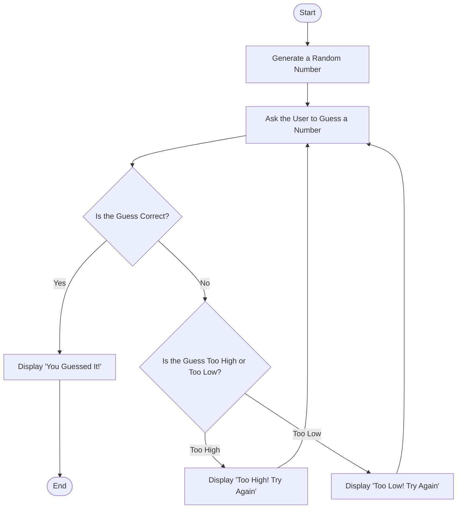

1. **Start**: The game begins
2. **Generate a Random Number**: The computer picks a random number
3. **Ask the User to Guess**: The user is prompted to enter a number
4. **Check the Guess**: If the guess is correct, the game will display
   "You Guessed It!" and ends. On the contrary, if the guess is incorrect,
   the game provides a hint (too high or too low) and asks the user to try again.
5. **Repeat**: Steps 3-4 repeat until the user guesses the correct number.
6. **End**: The game ends when the correct guess is made.
